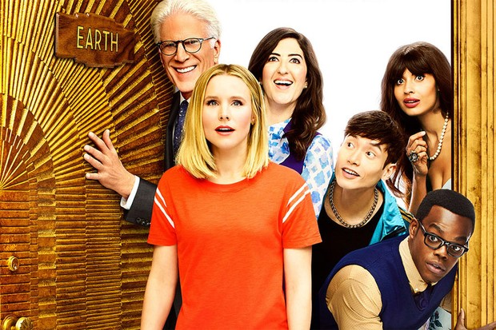

# Data for Good -  How can data help to make the world a better place

Like the TV Show 'The Good Place' shows us defining good and moral actions is not that easy, but I am still trying to gather data related projects here that in some way improve the life on our planet. 

Author: Enrico Lauckner ([GitHub](github.com/elauckne))

## Websites and Platforms

### [Data Kind](http://www.datakind.org/)

"Use data to not only make better decisions about what kind of movie we want to see, but what kind of world we want to see"

* [Predicting Human Rights Abuse](http://www.datakind.org/projects/predicting-and-preventing-human-rights-abuses)
* [Locate where children in need of hospices are likely to live](http://www.datakind.org/projects/finding-30000-missing-children)
* [Predicting Wheat Rust in Ethiopia](http://www.datakind.org/blog/predicting-wheat-rust-in-ethiopia-with-the-bill-melinda-gates-foundation)
* [Using Satellite Imagery to Generate Awareness and Funds for Refugees](http://www.datakind.org/blog/using-satellite-imagery-to-generate-awareness-and-funds-for-refugees)
* [Creating safer streets in US Cities / Analyzing Traffic Crashes in New York City](http://www.datakind.org/projects/creating-safer-streets-through-data-science)
    * A traffic exposure estimation model for estimating traffic volumes during a given time period on each city street segment. The results of this model were then used as a feature in the following crash injury models
    * A total injury based regression model for estimating the different levels of traffic injuries sustained in accidents normalized over a period of three years
    * A total injury based binary classification model for classifying crashes into high frequency and low frequency bins. It also estimates the likelihood of each road intersection being a member of one of the bins
* [Disaster Risk Management](http://www.datakind.org/blog/discovering-the-art-of-the-possible-for-machine-learning-and-disaster-risk-management)
    * How might satellite imagery and machine learning aid in disaster risk management and improving resilience for vulnerable communities
    * Is it possible to identify where people are at risk in a natural disaster, as measured through the locations and types of buildings in various countries?
    * Result: Building detection using satellite images for risk assessment is possible
    

### [Kaggle](http://www.kaggle.com/)

* [NOAA Fisheries Steller Sea Lion Population Count](https://www.kaggle.com/c/noaa-fisheries-steller-sea-lion-population-count)
* [Costa Rican Household Poverty Level Prediction](https://www.kaggle.com/c/costa-rican-household-poverty-prediction)
* [Humpback Whale Identification Challenge](https://www.kaggle.com/c/whale-categorization-playground)
* [LANL Earthquake Prediction](https://www.kaggle.com/c/LANL-Earthquake-Prediction)
* [The BeeImage Dataset: Annotated Honey Bee Images](https://www.kaggle.com/jenny18/honey-bee-annotated-images)
* [Match career advice questions with professionals in the field](https://www.kaggle.com/c/data-science-for-good-careervillage)

### [Google AI](https://ai.googleblog.com/)

[Keeping people safe with AI-enabled flood forecasting](https://www.blog.google/products/search/helping-keep-people-safe-ai-enabled-flood-forecasting/)
* It’s estimated that every year, 250 million people around the world are affected by floods, also costing billions of dollars in damages. Flood forecasting can help individuals and authorities better prepare to keep people safe, but accurate forecasting isn’t currently available in many areas
* A variety of elements—from historical events, to river level readings, to the terrain and elevation of a specific area—feed into the models. From there, maps are generated and run up to hundreds of thousands of simulations in each location. With this information, river flood forecasting models are created that can more accurately predict not only when and where a flood might occur, but the severity of the event as well.
* Incorporated information into Google Public Alerts.

[Acoustic Detection of Humpback Whales with CNNs](https://ai.googleblog.com/2018/10/acoustic-detection-of-humpback-whales.html)
* Algorithms to identify humpback whale calls in 15 years of underwater recordings from a number of locations in the Pacific
* The results of this research provide new and important information about humpback whale presence, seasonality, daily calling behavior, and population structure. This is especially important in remote, uninhabited islands, about which scientists have had no information until now.

[Forecasting earthquake aftershock locations with AI-assisted science](https://www.blog.google/technology/ai/forecasting-earthquake-aftershock-locations-ai-assisted-science/)
* Earthquakes typically occur in sequences: an initial "mainshock" (the event that usually gets the headlines) is often followed by a set of "aftershocks." Although these aftershocks are usually smaller than the main shock, in some cases, they may significantly hamper recovery efforts.  Although the timing and size of aftershocks has been understood and explained by established empirical laws, forecasting the locations of these events has proven more challenging.
* [Database](http://equake-rc.info/SRCMOD/) with information on more than 118 major earthquakes from around the world
* Applied a neural net to analyze the relationships between static stress changes caused by the mainshocks and aftershock locations. The algorithm was able to identify useful patterns.  
* The end result was an improved model to forecast aftershock locations and while this system is still imprecise, it’s a motivating step forward

[Predicting Bus Delays](https://ai.googleblog.com/2019/06/predicting-bus-delays-with-machine.html)
* Sequence model: The model is split into a sequence of timeline units—visits to street blocks and stops—each corresponding to a piece of the bus's timeline, with each unit forecasting a duration. A pair of adjacent observations usually spans many units, due to infrequent reporting, fast-moving buses, and short blocks and stops. Each unit predicts its duration independently, and the final output is the sum of the per-unit forecasts
* Learning the Local Rhythms: The model learns an embedding of the local time of day and day of week signals, which, when combined with the location representation, captures salient local variations, like rush hour bus stop crowds, that aren't observed via car traffic.

### [The Pudding](https://pudding.cool/)

"The Pudding explains ideas debated in culture with visual essays. By wielding original datasets, primary research, and interactivity, we try to thoroughly explore complex topics."

* [Driving times to abortion clinics in the US](https://pudding.cool/2017/09/clinics/)
* [Women in US Congress](https://pudding.cool/2018/07/women-in-congress)
* [Why the tech sector may not solve America’s looming automation crisis](https://pudding.cool/2018/08/retraining/)
    * 5% of America’s employees may be replaced by robots, and transitioning them to become software developers seems to be a popular solution. Here’s why it might be misguided
    * How should workers train and be trained to most effectively switch jobs?
* [Choosing the News](https://pudding.cool/2018/01/chyrons/)
    * Cable news is a major source of information for millions of Americans. But the story you get depends on the channel you watch
    * Here’s what this all comes down to: no matter how you slice it, whether by overall coverage, coverage over time, or context, two people who watch different channels could come away with vastly different ideas of key issues in the news 

## Initiatives

### [eBird initiative](https://ebird.org/about)
* eBird is the world’s largest biodiversity-related citizen science project, with more than 100 million bird sightings contributed each year
* Goal is to gather information from birdwatchers in the form of checklists of birds, archive it, and freely share it to power new data-driven approaches to science, conservation and education

### [Quake Hunters](https://worldwind.arc.nasa.gov/quakehunter/)
* Earthquakes are among the most destructive natural disasters, in terms of death tolls and the cost of recovery. They’re also nearly impossible to predict, but seismologists and amateurs alike now have another tool to help them better understand the behavior of the planet’s crust
* An open source virtual globe originally developed by NASA as an education tool and used by countless government agencies, nonprofit organizations, and commercial entities around the world now provides the ability to track and visualize 100 years’ worth of global earthquake data.

## Indexes

Measurement/Collecting and aggregation of performance indicators to provide a foundation for effective policymaking. 

### [Environmental Performance Index](http://epi.yale.edu/)
* Scores 180 countries on 24 performance indicators across ten issue categories covering environmental health and ecosystem vitality
* Air Quality, Water & Sanitation, Heavy Metals, Biodiversity & Habitat, Forests, Fisheries, Climate & Energy, Air Pollution, Water Resources, and Agriculture
* Key Findings 2018:
    * Air quality remains the leading environmental threat to public health
    * The world has made great strides in protecting marine and terrestrial biomes
    * Most countries improved GHG emissions intensity over the past ten years. These trends are promising yet must be accelerated to meet the ambitious targets of the 2015 Paris Climate Agreement.

### [Global Peace Index](http://visionofhumanity.org/indexes/global-peace-index/)
* Ranks 163 independent states and territories according to their level of peacefulness
* 2018 Global Peace Index shows the world is less peaceful today than at any time in the last decade

### [Notre Dame-Global Adaptation Index](https://gain.nd.edu/our-work/country-index/)
* The ND-GAIN Country Index summarizes a country's vulnerability to climate change and other global challenges in combination with its readiness to improve resilience
* It aims to help governments, businesses and communities better prioritize investments for a more efficient response to the immediate global challenges ahead

### [Wildlife Picture Index](http://wpi.teamnetwork.org/wpi/welcome)
* The WPI is an indicator derived from primary camera trap data designed to meet the requirements of biodiversity monitoring indexes. 
* The TEAM Network adopted this indicator as a way to synthesize and understand the effects of climate change and land use change on tropical terrestrial mammal and bird diversity. 
* Wildlife Insights is hard at work to create a new analytics system that will harness the power of cutting-edge technologies to allow users to create custom WPI datasets and automatically calculate the WPI and other analytical products.

### [Global Traffic Scorecard](http://inrix.com/scorecard/#)
* Analysis of congestion and mobility trends in more than 200 cities, across 38 countries.
* Allows for cross-national rankings and analysis, delivering in-depth insights for drivers and policy-makers to make better decisions informed by big data

## Articles / Research

### [Digital Agriculture: Farmers in India are using AI to increase crop yields](https://news.microsoft.com/en-in/features/ai-agriculture-icrisat-upl-india/)

* Indian agriculture has been traditionally rain dependent and climate change has made farmers extremely vulnerable to crop loss. Insights from AI through the agriculture life cycle will help reduce uncertainty and risk in agriculture operations.
* Microsoft in collaboration with ICRISAT, developed an AI Sowing App powered by Microsoft Cortana Intelligence Suite including Machine Learning and Power BI. The app sends sowing advisories to participating farmers on the optimal date to sow. 
* The farmers don’t need to install any sensors in their fields or incur any capital expenditure. All they need is a feature phone capable of receiving text messages.

### [Child Growth Monitor: Using AI to solve world hunger and malnutrition](https://news.microsoft.com/en-in/features/child-growth-monitor-malnutrition-india-microsoft-ai/)

* One of the biggest problems in tackling malnutrition is that it’s difficult to tell by conventional means or the naked eye whether a child suffers from malnutrition. Most of the time, due to flawed data, aid workers are not able to reach out to children who urgently require assistance
* The team at Welthungerhilfe is developing an AI-powered smartphone app called Child Growth Monitor (CGM) that can scan children and instantly detect malnutrition
* The app loads captured data into Microsoft Azure. Nutritionists and IT specialists then evaluate the scans by using Microsoft AI solutions, pinpointing a child’s dietary health. The experts later pump that data back into the app, training the algorithm to get smarter with each measurement.

### [Reducing food’s environmental impacts through producers and consumers ](http://science.sciencemag.org/content/360/6392/987 )

* Avoiding meat and dairy is ‘single biggest way’ to reduce your impact on Earth
* The study created a huge dataset based on almost 40,000 farms in 119 countries and covering 40 food products that represent 90% of all that is eaten. It assessed the full impact of these foods, from farm to fork, on land use, climate change emissions, freshwater use and water pollution (eutrophication) and air pollution (acidification).
* It reveals huge footprint of livestock which provides just 18% of calories but takes up 83% of farmland
* The new research shows that without meat and dairy consumption, global farmland use could be reduced by more than 75% – an area equivalent to the US, China, European Union and Australia combined – and still feed the world
* Loss of wild areas to agriculture is the leading cause of the current mass extinction of wildlife

### [Helping farmers identify diseased plants](https://www.blog.google/technology/ai/ai-takes-root-helping-farmers-identity-diseased-plants/)
* PlantVillage and the International Institute of Tropical Agriculture (IITA) developed a solution using machine learning that could help farmers better identify and manage diseases for cassava, a crop in Africa that provides food for over half a billion people daily.
* They annotated thousands of cassava plant images, identifying and classifying diseases to train a machine learning model using TensorFlow. 
* Once the model was trained to identify diseases, it was deployed in the app. Farmers can wave their phone in front of a cassava leaf and if a plant had a disease, the app could identify it and give options on the best ways to manage it.

### [Googling Food Webs](http://journals.plos.org/ploscompbiol/article?id=10.1371/journal.pcbi.1000494)
* Analysis of extinction risk in ecosystems
* Approach inspired by Google PageRank uses a recursive definition: a species is important if important species rely on it for their survival. Results show that the algorithm outperforms all other measures of species importance from the perspective of fastest route to collapse.

### [Artificial intelligence finds unknown virus species](https://www.nature.com/articles/d41586-018-03358-3)
* Although viruses influence everything from human health to the degradation of trash, they are hard to study. Scientists cannot grow most viruses in the lab, and attempts to identify their genetic sequences are often thwarted because their genomes are tiny and evolve fast
* Researchers have used artificial intelligence (AI) to discover nearly 6,000 previously unknown species of virus

### [Mapping Controversies: Abortion Debate](https://towardsdatascience.com/mapping-controversies-abortion-debate-7235029fc6d9)
* Investigate how an online encyclopaedia like Wikipedia that pursues neutrality presents controversial debates

### [Building support for pollution-free cities: an Open Data workflow](https://towardsdatascience.com/building-support-for-pollution-free-cities-an-open-data-workflow-888096797cc9)
* Open Data from New York City
* Air Pollution per District
* Comparison with income
* Identifying dangers for schools

### [Dairy farming, solar panels, and diagnosing Parkinson's disease: what can you do with deep learning?](https://www.fast.ai/2019/02/21/dl-projects/)
* Building Tools for Microbiologists in Kenya
* Dairy Goat Farming
* Use genetic information to improve cancer treatment

